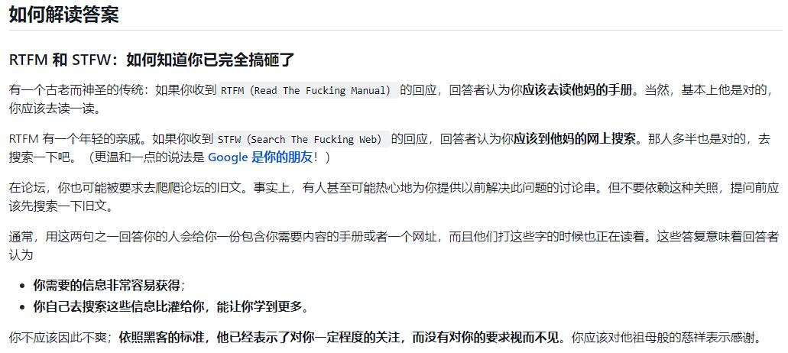
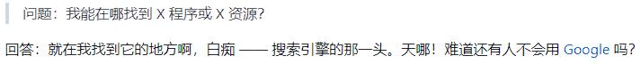

# 在UTE群内询问问题前必读

在UTE群内询问问题前请在此处查找解决方法 如果没有再进行询问

并且，请善用搜索引擎和GameMaker官方文档

此处没有的内容可以查阅此视频：https://www.bilibili.com/video/BV13d4y1K72G/

不管是在任何地方中询问前都请仔细阅读 [提问的智慧](https://github.com/ryanhanwu/How-To-Ask-Questions-The-Smart-Way/blob/main/README-zh_CN.md)

RTFM和STFW的释义

这是一个愚蠢的问题

# 字体篇

## 菜单中文字体

首先创建一个新字体，设好名

选择字体为SimSun，大小10，关闭抗锯齿

点击添加范围 从文件获取

字库：https://pan.bilnn.com/s/a9ZOFL

确认后GM会卡一会 好了之后关闭字体窗口

打开text_typer的用户事件5

第22行 *_group_font[0,1]=Lang_GetFont(Lang_GetString("font.dialog.1"));*

把=号后面改为刚刚的字体名

接下来的4行 把=号后面都改为1

对32~36行也进行同样操作 但是第35行=号后面为0

## 敌人中文字体

安装方正像素16（右键→为所有用户安装）

下载：https://pan.bilnn.com/s/8rbWcb

好了后重启GM或者点击帮助→刷新系统字体→确认

添加新字体 设置好名字

选择字体FZXS16 大小12 关闭抗锯齿

和上一段同样方法导入字库

打开text_typer用户事件5

第42行 *_group_font[2,1]=Lang_GetFont(Lang_GetString("font.battle.1"));*

把=号后面的改为这个字体

接下来4行 把=号后面都改为1

## Sans/Papyrus中英字体

安装这俩字体（右键→为所有用户安装）

下载：https://pan.bilnn.com/s/PMd1C5

好了后重启GM或者点击帮助→刷新系统字体→确认

添加新字体 设置好名字

选择字体 方正少儿_GBK/迷你简卡通 大小均为12 关闭抗锯齿

和前面同样方法导入字库

打开text_typer用户事件5

在47行后面写入以下内容

_group_font[X,0]=字体名 
_group_font_scale_x[X,0]=1 
_group_font_scale_y[X,0]=1 
_group_font_space_x[X,0]=1 
_group_font[X,1]=字体名 
_group_font_scale_x[X,1]=1 
_group_font_scale_y[X,1]=1 
_group_font_space_x[X,1]=1; 
_group_font_space_y[X]=1 

把 字体名 改为你的字体名 两个相同

X为顺序 可以参考用户事件5上方代码设置

Sans和Papyrus字体分开两段设置

完成后在打字机使用{font X}来使用对应字体